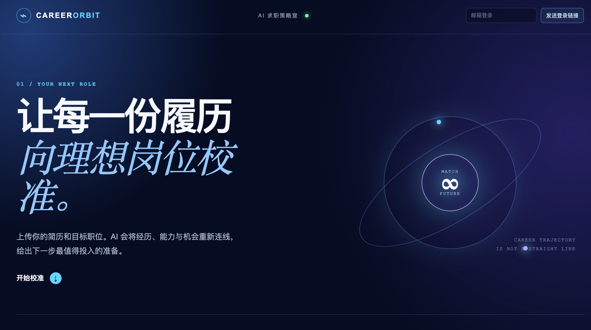

# AI 简历岗位匹配助手

AI 简历岗位匹配助手是一款面向求职准备的工具：上传可提取文字的 PDF 简历、粘贴目标岗位描述，即可获得岗位匹配分析、简历优化建议、定制求职信、面试预演题和能力雷达图。



## 功能

- PDF 简历文字提取与格式校验
- 岗位匹配度、优势/差距分析和可执行的简历优化建议
- 定制求职信、10 个面试问题及参考回答、六维能力雷达图
- Supabase 登录、私有简历存储与最近 30 条历史分析记录
- 纯 BYOK：用户临时输入自己的 API Key，支持 DeepSeek、通义千问、Kimi、豆包
- 邮箱魔法链接与 Google OAuth 登录入口

## 技术栈

- Next.js 15、React 19、TypeScript
- Supabase Auth、Postgres 与私有 Storage
- `pdfjs-dist` 用于浏览器端 PDF 文本解析
- DeepSeek / OpenAI Chat Completions 兼容接口

## 本地运行

要求：Node.js 22 或更高版本。

```bash
npm install
cp .env.example .env.local
npm run dev
```

打开 <http://localhost:3000>。

## 环境变量

在 `.env.local` 中配置：

```dotenv
NEXT_PUBLIC_SUPABASE_URL=https://your-project.supabase.co
NEXT_PUBLIC_SUPABASE_PUBLISHABLE_KEY=sb_publishable_your_key
```

绝不把 `service_role` 或任何用户的 API Key 写入 `NEXT_PUBLIC_` 环境变量或提交到仓库。

## 登录配置

邮箱登录由 Supabase Auth 提供。Google 登录需要在 Google Cloud 与 Supabase Dashboard 中启用 Provider 并设置回调地址，完整步骤见 [SUPABASE_AUTH_SETUP.md](SUPABASE_AUTH_SETUP.md)。

## BYOK 模型与安全

本项目不提供或保存平台模型密钥。用户每次分析时自行选择厂商、输入模型名称和 API Key；Key 仅在本次服务端转发请求中使用，不保存到数据库、Cookie、本地存储或日志中。

服务端只允许以下固定官方接口，不接受用户自定义 URL：

- DeepSeek：`https://api.deepseek.com/chat/completions`
- 通义千问：`https://dashscope.aliyuncs.com/compatible-mode/v1/chat/completions`
- Kimi：`https://api.moonshot.cn/v1/chat/completions`
- 豆包：`https://ark.cn-beijing.volces.com/api/v3/chat/completions`

## 常用命令

```bash
npm run dev       # 开发服务
npm run build     # 生产构建与类型检查
npm run start     # 启动生产构建
npx tsc --noEmit  # 仅执行 TypeScript 检查
```

## 当前状态

这是课程作业/原型项目。上线前请完成：Supabase RLS 与 Storage 策略复核、Google OAuth 配置、私有模型地址白名单、速率限制和隐私告知。
